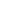
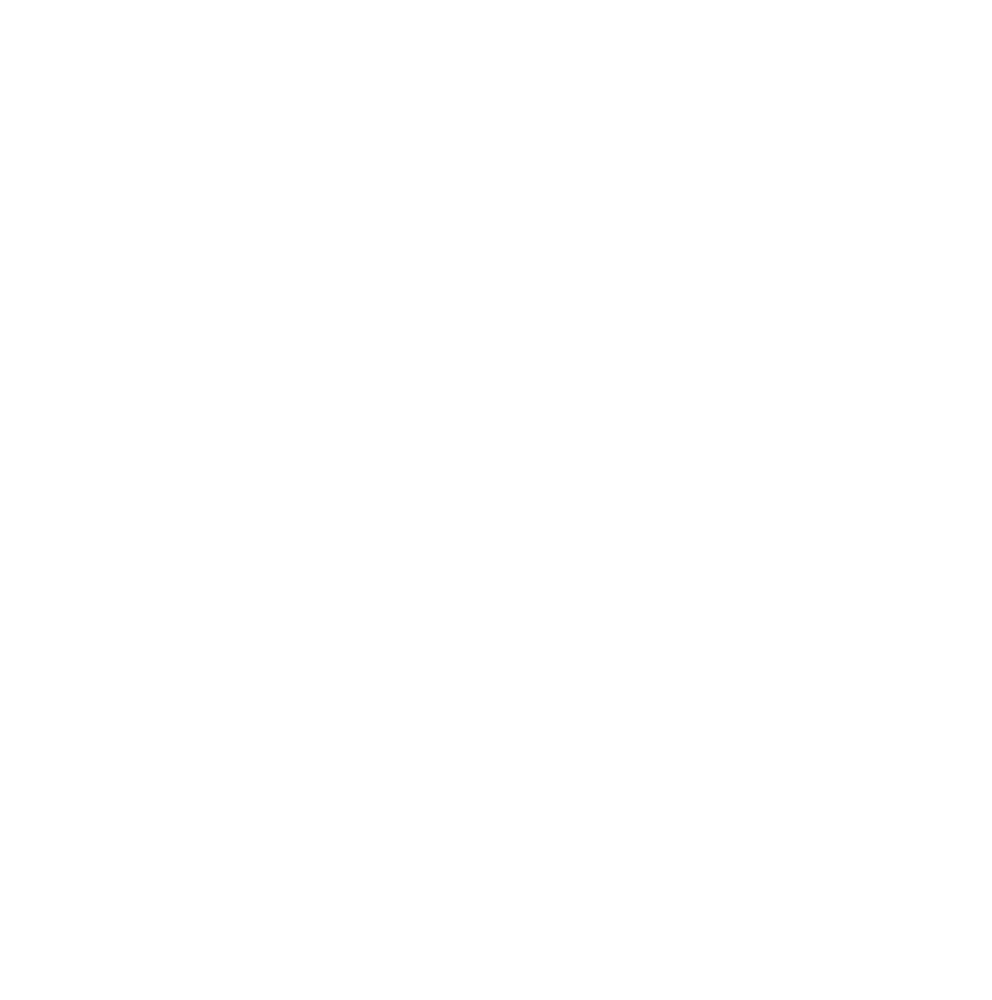

# Awesome Minimalism 

A curated list of minimal apps & resources.

Inspired by [neiesc/awesome-minimalist](https://github.com/neiesc/awesome-minimalist#awesome-minimalist-frameworks-) 
Website format - [is.gd/awesome_minimalism](https://is.gd/awesome_minimalism)
  
- [Awesome Minimalism](#awesome-minimalism-)

  - [Dev](#dev)
  - [Personalization](#personalization)
  - [Productivity](#productivity)
  - [Text Editors](#text-editors)
  - [Web Dev](#web-dev)

## Dev

| Name              | Repo                                                   | Platforms                                                                                                                                             | Last Commit                                                                                                    | License                                                        |
|------------------ |------------------------------------------------------- |------------------------------------------------------------------------------------------------------------------------------------------------------ |--------------------------------------------------------------------------------------------------------------- |--------------------------------------------------------------- |
| alacritty         | [Repo](https://github.com/alacritty/alacritty)         |     |          |  2   |
| aria2             | [Repo](https://github.com/aria2/aria2)                 |     |                  |  2      |
| github-cli        | [Repo](https://github.com/cli/cli)                     |     |                      |                    |
| httpie            | [Repo](https://github.com/httpie/httpie)               |     |                |  2  |
| iredis            | [Repo](https://github.com/laixintao/iredis)            |     |             |  2  |
| kube-shell        | [Repo](https://github.com/cloudnativelabs/kube-shell)  |     |   |  2   |
| nvm               | [Repo](https://github.com/nvm-sh/nvm)                  |                                                       |                   |                    |
| scoop             | [Repo](https://github.com/ScoopInstaller/Scoop/)       |                                                                                                     |         |                    |
| windows-terminal  | [Store](https://is.gd/HAXFZL)                          |                                                                                                     |           |                    |

## Personalization

| Name            | Repo                                                                 | Platforms                                                                                                                                             | Last Commit                                                                                                               | License                                                    |
|---------------- |--------------------------------------------------------------------- |------------------------------------------------------------------------------------------------------------------------------------------------------ |-------------------------------------------------------------------------------------------------------------------------- |----------------------------------------------------------- |
| mordernFlyouts  | [Repo](https://github.com/ModernFlyouts-Community/ModernFlyouts)     |                                                                                                     |   |                |
| openBoard       | [Repo](https://github.com/openboard-team/openboard)                  |                                                                                                     |                |  2  |
| pure            | [Repo](https://github.com/sindresorhus/pure)                         |                                                       |                       |                |
| ratio           | [Store](https://play.google.com/store/apps/details?id=com.bllocosn)  |                                                                                                     |                           |               |
| taskbarX        | [Repo](https://github.com/ChrisAnd1998/TaskbarX)                     |                                                                                                     |                   |                |
| tilde           | [Repo](https://github.com/xvvvyz/tilde)                              |   |                            |          |
| xfce            | [Repo](https://github.com/xfce-mirror/xfwm4)                         |                                                                                                       |                       |  2  |

## Productivity

| Name          | Repo                                                                                            | Platforms                                                                                                                                                                                                                                               | Last Commit                                                                                                      | License                                                        |
|-------------- |------------------------------------------------------------------------------------------------ |-------------------------------------------------------------------------------------------------------------------------------------------------------------------------------------------------------------------------------------------------------- |----------------------------------------------------------------------------------------------------------------- |--------------------------------------------------------------- |
| authy         | [Site](https://authy.com/download/)                                                             |       |                  |                   |
| firefoxFocus  | [Repo](https://github.com/mozilla-mobile/focus-android)                                         |                                                                                                                                                         |   |  2  |
| imageGlass    | [Repo](https://github.com/d2phap/ImageGlass#imageglass---a-lightweight-versatile-image-viewer)  |                                                                                                                                                                                                       |              |  3      |
| min           | [Repo](https://github.com/minbrowser/min)                                                       |                                                                                                       |                 |  2   |
| otoMusic      | [Store](https://play.google.com/store/apps/details?id=com.piyush.music)                         |                                                                                                                                                                                                       |                  |                   |
| protonDrive   | [Repo](https://github.com/ProtonMail/WebClients/tree/main/applications/drive)                   |  |          |  3      |
| protonMail    | [Repo](https://github.com/ProtonMail/WebClients/tree/main/applications/mail)                    |   |          |  3      |

## Text Editors

| Name          | Repo                                                                                        | Platforms                                                                                                                                             | Last Commit                                                                                                        | License                                                    |
|-------------- |-------------------------------------------------------------------------------------------- |------------------------------------------------------------------------------------------------------------------------------------------------------ |------------------------------------------------------------------------------------------------------------------- |----------------------------------------------------------- |
| code writter  | [Store](https://apps.microsoft.com/store/detail/code-writer/9WZDNCRFHZDT)                   |                                                                                                     |                    |               |
| minimalist    | [Site](https://www.minimalist.app)                                                          |                                                                                                       |                    |               |
| notion        | [Site](https://notion.so)                                                                   |     |                    |               |
| quickpad      | [Store](https://apps.microsoft.com/store/detail/quick-pad-fluent-notepad-app/9PDLWQHTLSV3)  |                                                                                                     |            |  2  |
| simple note   | [Repo](https://github.com/Automattic/simplenote-electron)                                   |   |   |  2  |
| vscode        | [Repo](https://github.com/microsoft/vscode)                                                 |     |                 |                |

## Web Dev

| Name            | Repo                                                                     | Platforms                                          | Last Commit                                                                                                   | License                                                      |
|---------------- |------------------------------------------------------------------------- |--------------------------------------------------- |-------------------------------------------------------------------------------------------------------------- |------------------------------------------------------------- |
| chota.css       | [Repo](https://github.com/jenil/chota)                                   |   |                 |                  |
| pico.css        | [Repo](https://github.com/picocss/pico)                                  |   |                |                  |
| pure.css        | [Repo](https://github.com/pure-css/pure)                                 |   |               |              |
| water.css       | [Repo](https://github.com/kognise/water.css)                             |   |           |                  |
| jetBrains Mono  | [Repo](https://github.com/JetBrains/JetBrainsMono)                       |   |     |  1.1  |
| mem Mono        | [Repo](https://github.com/oidoid/mem)                                    |   |                  |  3    |
| openSans        | [Repo](https://github.com/googlefonts/opensans)                          |   |        |  1.1  |
| segoe UI        | [Site](https://learn.microsoft.com/en-us/typography/font-list/segoe-ui)  |   |               |                 |
| simpleIcons     | [Repo](https://github.com/simple-icons/simple-icons)                     |   |   |                  |
| teenyIcons      | [Repo](https://github.com/teenyicons/teenyicons)                         |   |       |                  |

## Contributions

 Contributions are welcome, you may suggest apps to add along with a pre-existing or new category in github issues.
